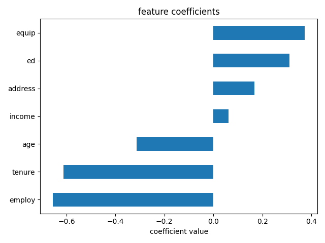

# Customer Churn Prediction Using Logistic Regression

A binary classification project that predicts whether a telecommunications customer will churn using **logistic regression**. Built as **Project 03 of my AI Engineering Journey**, based on IBM's machine learning learning materials and implemented as a modular Python application.

## Project overview

Customer churn is when a customer stops using a company's services. This project estimates the probability that a customer will churn based on seven customer attributes.

- **Target:** `churn` (`0` = no churn; `1` = churn)
- **Model:** scikit-learn `LogisticRegression` with default parameters
- **Evaluation:** predicted classes, predicted probabilities and log loss
- **Interpretability:** bar chart of learned feature coefficients

## Dataset

This project uses IBM's sample telecommunications customer churn dataset, `ChurnData.csv`.

**[Download ChurnData.csv](https://cf-courses-data.s3.us.cloud-object-storage.appdomain.cloud/IBMDeveloperSkillsNetwork-ML0101EN-SkillsNetwork/labs/Module%203/data/ChurnData.csv)**

The dataset contains **200 records and 28 columns**. The target distribution is **142 non-churn customers (71%)** and **58 churn customers (29%)**. There were no missing values in the supplied dataset.

### Input features

| Feature | Description |
|---|---|
| `tenure` | Length of the customer relationship |
| `age` | Customer age |
| `address` | Time at current address |
| `income` | Customer income |
| `ed` | Education level (encoded numerically) |
| `employ` | Employment duration |
| `equip` | Equipment ownership indicator |

The model uses these seven features, rather than all 27 available input columns, to follow the IBM lab.

## How it works

1. **Load:** Read `ChurnData.csv` with pandas.
2. **Select:** Extract the seven features and convert `churn` to integer labels.
3. **Standardize:** Apply `StandardScaler` to put input features on comparable scales.
4. **Split:** Use an 80/20 train/test split (`random_state=4`): **160 training records** and **40 test records**.
5. **Train:** Fit a logistic regression classifier using scikit-learn's default settings.
6. **Predict:** Produce both class labels (`predict`) and probabilities (`predict_proba`).
7. **Evaluate:** Calculate test-set log loss from the actual labels and predicted probabilities.
8. **Visualize:** Plot the model's seven learned coefficients.


### Why logistic regression?

Despite its name, logistic regression is a classification algorithm. It combines the input features linearly and passes the result through the sigmoid function to produce a probability between 0 and 1:

$$
P(\text{churn}=1 \mid X) = \frac{1}{1 + e^{-(w^T X + b)}}
$$

By default, a probability of at least 0.5 is classified as churn (`1`); otherwise, the prediction is no churn (`0`).

### Why log loss?

Accuracy considers only the predicted class. **Log loss** also considers the confidence of each probability prediction. It penalizes predictions that confidently assign low probability to the actual outcome. **Lower log loss is better.**

For a single binary prediction, with actual label `y` and predicted churn probability `p`:

$$
L = -\left[y\log(p) + (1-y)\log(1-p)\right]
$$

## Results

| Item | Result |
|---|---:|
| Training samples | 160 |
| Test samples | 40 |
| Input features | 7 |
| **Test log loss** | **0.4069** |

The model produced predicted labels and probabilities for all 40 test customers. Log loss alone does not establish accuracy, recall or performance on new populations; those metrics were not measured in this implementation.

### Feature coefficients



The coefficient chart from this run shows:

- **Negative coefficients:** `employ`, `tenure`, `age`.
- **Positive coefficients:** `income`, `address`, `ed`, `equip`.

Because the inputs were standardized, coefficients describe the direction and relative strength of each feature's association with the model's **log-odds** of churn, holding the other features constant. They are **not causal effects**.

## Project structure

This project is designed to run inside the shared `AI-Engineering-workspace`:

```text
AI-Engineering-workspace/
├── .venv/                              # Shared virtual environment
├── datasets/
│   └── churn/
│       └── ChurnData.csv               # Download separately
└── 03-Customer-Churn-Prediction/
    ├── src/
    │   ├── __init__.py
    │   ├── config.py                   # Dataset path and selected features
    │   ├── data_loader.py              # CSV loading
    │   ├── preprocessing.py            # Standardization and split
    │   ├── trainer.py                  # Logistic regression training
    │   ├── evaluator.py                # Predictions and log loss
    │   └── visualizer.py               # Coefficient chart
    ├── outputs/
    │   └── feature_coefficients.png
    ├── main.py                         # End-to-end entry point
    └── README.md
```

**Note:** `src/config.py` expects the dataset at `../datasets/churn/ChurnData.csv`, relative to this project folder. If you clone this project alone, create the `datasets/churn/` directory alongside the project folder or update `DATASET_PATH` in `src/config.py`.

## Setup and run

**Requirements:** Python 3.10+ and the packages `numpy`, `pandas`, `scikit-learn` and `matplotlib`.

From the `AI-Engineering-workspace` directory, create and activate a shared virtual environment if you do not already have one:

```powershell
python -m venv .venv
.\.venv\Scripts\Activate.ps1
pip install numpy pandas scikit-learn matplotlib
```

Download the dataset using the link above and save it as:

```text
datasets/churn/ChurnData.csv
```

Then run:

```powershell
python 03-Customer-Churn-Prediction/main.py
```

The program prints predicted classes, predicted probabilities and test log loss. It also displays the coefficient chart and saves it to `outputs/feature_coefficients.png`.

## Key learnings

- Logistic regression and the sigmoid function for binary classification
- The difference between predicted labels and predicted probabilities
- Feature standardization and train/test splitting
- Evaluating probability predictions with log loss
- Interpreting logistic regression coefficients
- Organizing a machine learning workflow into reusable Python modules

## Limitations

- **Small dataset:** Only 200 records and 40 test examples; results may vary with the split.
- **Class imbalance:** 71% of the records are non-churn customers.
- **Preprocessing leakage:** To reproduce the IBM lab's sequence, the scaler is fitted before the train/test split. For a production-oriented implementation, split first and fit the scaler **only on training data**.
- **Limited evaluation:** This learning project reports log loss; additional metrics and validation would be needed before deployment.

## Acknowledgment

Based on the customer churn logistic regression exercise from **IBM Developer Skills Network**. The modular Python implementation, visualization and project documentation were developed for my AI Engineering Journey.
